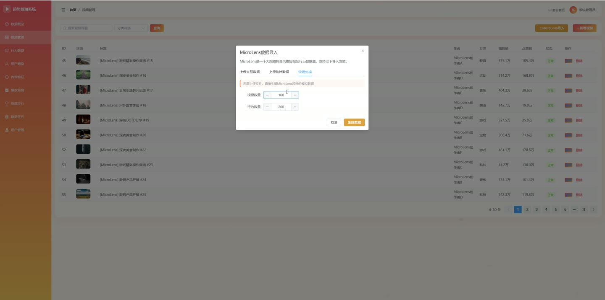
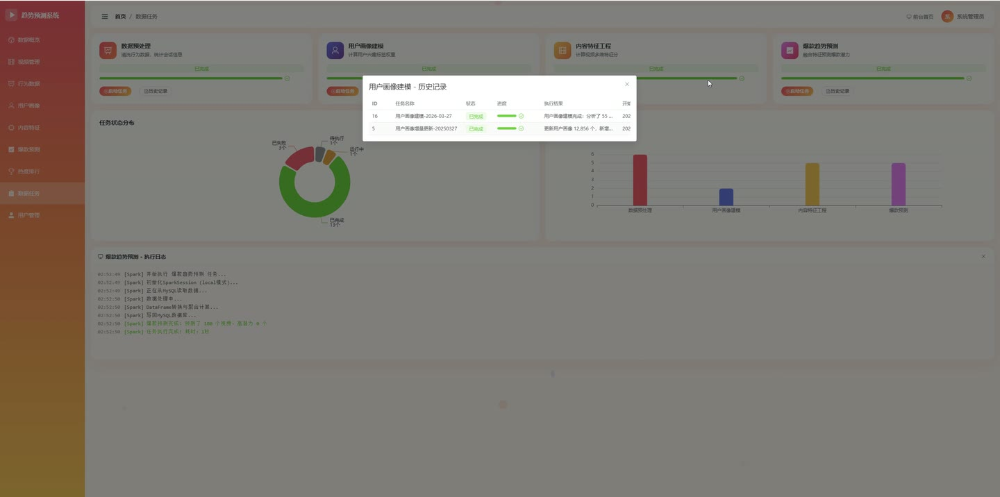
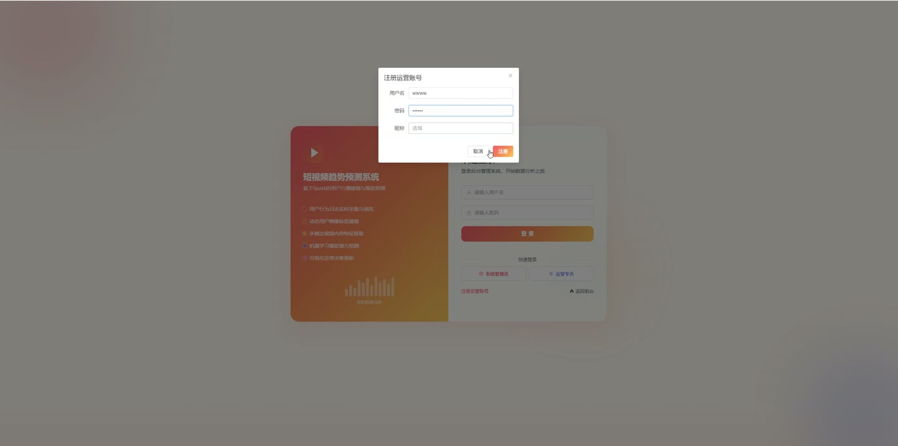
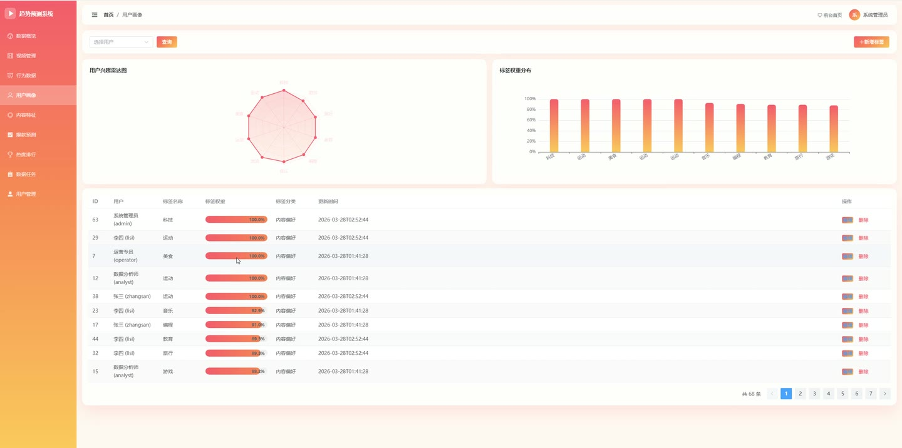
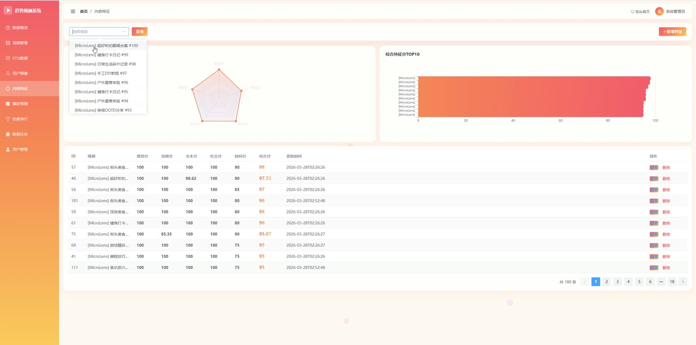
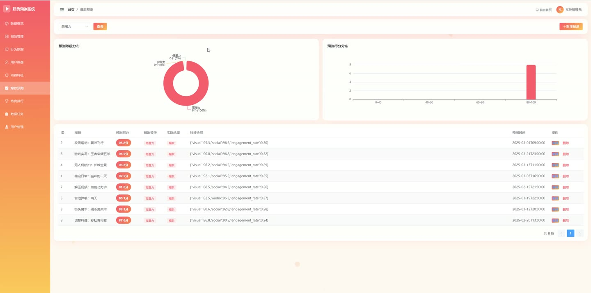

# (附文档)Springboot3+Vue3+MySQL 基于Spark的短视频用户兴趣建模与爆款趋势预测系统

**技术栈**：Springboot3、Vue3、MySQL

### 系统简介

本系统是一套基于 Spark 的短视频用户兴趣建模与爆款趋势预测平台，采用前后端分离架构。后端使用 Spring Boot 3 提供 REST 接口，通过 Spark 完成行为数据预处理、用户画像建模、内容特征工程与爆款趋势预测；前端使用 Vue 3 构建前台展示与后台管理界面。系统包含普通用户端与管理员端两类角色，覆盖短视频浏览、榜单查看、趋势预测展示以及后台数据全流程管理。
 
### 核心功能
 
### 普通用户端

 
- 浏览短视频列表，支持按分类筛选、按标题关键词搜索，并按播放量倒序排列。 
- 查看短视频详情，展示标题、封面、作者、简介、时长、标签及播放、点赞、评论、分享等互动数据。 
- 获取视频分类列表，用于前台分类筛选导航。 
- 查看爆款趋势预测列表，支持按预测等级筛选，按预测得分倒序分页展示，并关联展示对应视频信息。 
- 查看热门榜单列表，支持按榜单类型查询，按排名位置升序返回并关联视频详情。 
- 查看前台统计概览，包括视频总数、用户总数、行为总数、预测总数、任务总数与画像总数。 
- 通过登录页完成账号登录，登录后会话信息写入 Session，支持退出登录与获取当前登录用户信息。 
- 在登录页注册运营账号，注册时校验用户名唯一并默认分配 operator 角色。
 
### 管理员端

 
- 查看后台统计看板，汇总视频数、用户数、行为数、预测数、任务数与画像数等核心指标。 
- 用户管理：分页查询用户列表，支持按用户名或昵称关键词搜索，新增、编辑、删除用户，编辑时可选重置密码。 
- 视频管理：分页查询视频，支持按标题关键词与分类筛选，新增、修改、删除视频记录。 
- 行为数据管理：分页查询用户行为，支持按用户 ID 与行为类型筛选，查看各行为类型数量统计，新增与删除行为记录。 
- 用户画像管理：分页查询画像标签，支持按用户 ID 筛选并按标签权重倒序，按用户查询画像列表，新增、修改、删除画像。 
- 内容特征管理：分页查询视频特征，支持按视频 ID 筛选并按综合得分倒序，新增、修改、删除特征记录。 
- 爆款预测管理：分页查询预测结果，支持按预测等级筛选并按预测得分倒序，新增、修改、删除预测记录。 
- 榜单管理：分页查询热门榜单，支持按榜单类型筛选，新增与删除榜单记录。 
- 数据任务管理：分页查询任务，支持按任务类型与状态筛选；执行预处理、建模、特征工程、预测四类 Spark 任务并记录进度、起止时间与执行结果；查看各类型最新任务与近 20 条历史记录；新增、修改、删除任务。 
- 数据导入：上传 MicroLens 交互数据文件，按行解析并批量写入行为记录，自动补建缺失视频；上传点赞与播放量统计文件，批量更新对应视频的点赞数与播放量。 
- 模拟数据生成：按指定视频数与行为数一键生成 MicroLens 风格短视频与用户行为数据。 
- 下拉选项接口：提供用户下拉列表与视频下拉列表，供后台表单选择使用。 
- 文件上传：接收上传文件，按 UUID 重命名后保存至上传目录并返回访问路径。
 
### 技术栈

 后端框架Spring Boot 3 ORM 框架MyBatis-Plus（分页插件、逻辑删除、驼峰映射） 计算引擎Apache Spark（SparkSession、Spark SQL、DataFrame） 权限与会话HttpSession 登录态 + 拦截器校验 /api/admin/** 路径 密码加密BCrypt 前端框架Vue 3（组合式 API） 前端路由Vue Router（createWebHistory，全局前置守卫） 状态管理Pinia（用户状态 Store） UI 组件库Element Plus 数据库MySQL
 
### 交付内容

 
- 后端完整源码 
- 前端完整源码 
- 数据库初始化脚本 
- 万字文档

## 界面展示

---

## 获取完整源码 + 万字文档

本仓库为项目介绍页。**完整前后端源码、数据库初始化脚本、万字项目文档**，请加微信 `kangkangcode`，或访问 [codekk.top](http://codekk.top) 获取。

可作课程设计 / 毕业设计参考，支持远程部署调试。